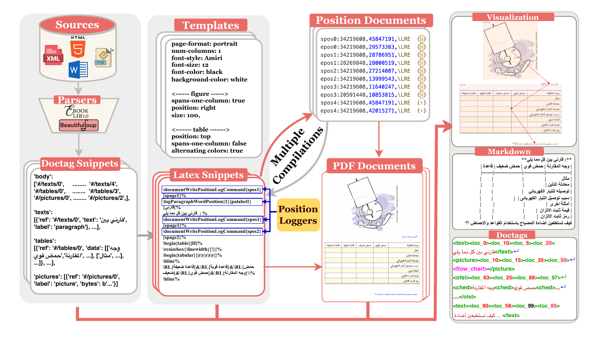
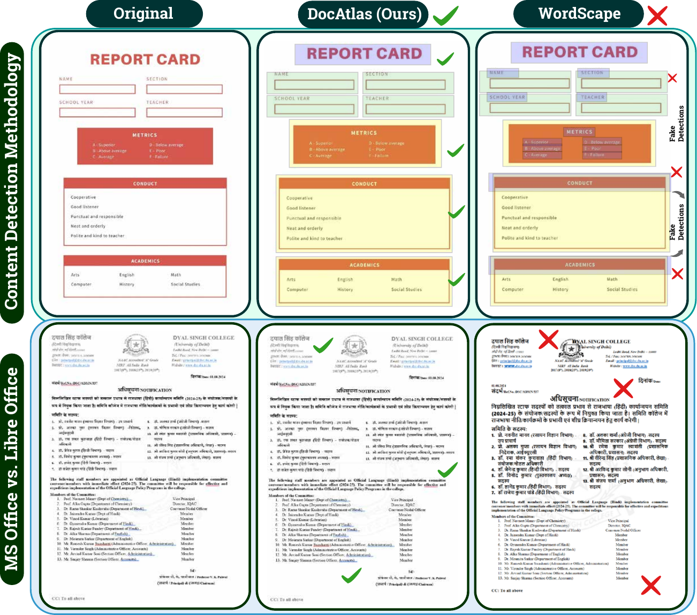
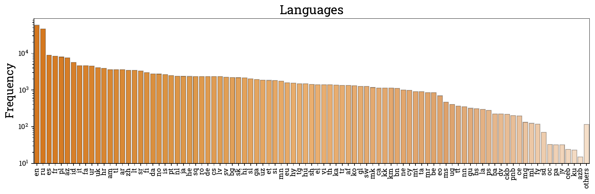
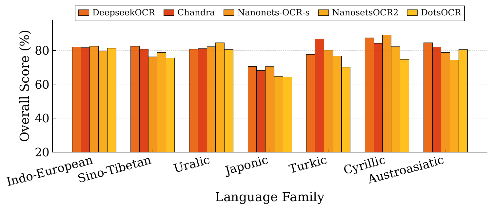

<h1 align="center">
  
  DocAtlas: Multilingual Document Understanding Across 80+ Languages
</h1>

<p align="center">
  Ahmed Heakl<sup>1</sup>, Youssef Mohamed<sup>1</sup>, Abdullah Sohail<sup>1</sup>, Rania Elbadry<sup>1</sup>,
  Ahmed Nassar<sup>2</sup>, Peter W. J. Staar<sup>2</sup>, Fahad Shahbaz Khan<sup>1</sup>, Imran Razzak<sup>1</sup>, Salman Khan<sup>1</sup>
  <br>
  <sup>1</sup>MBZUAI &nbsp;&nbsp; <sup>2</sup>IBM Research
</p>

<p align="center">
  <a href="https://arxiv.org/abs/2605.12623"></a>
  <a href="https://huggingface.co/datasets/ahmedheakl/docatlas_instruct"></a>
  <a href="https://huggingface.co/datasets/ahmedheakl/DocAtlas-Bench"></a>
  <a href="LICENSE"></a>
</p>

<p align="center">
  
</p>

**Overview of the DocAtlas framework.** (Left) Global script coverage across 80+ languages spanning 10 writing systems, illustrating the geographical and typological diversity of the corpus. (Right) Cross-lingual transfer performance after DPO training, showing consistent gains in both in-domain and out-of-domain accuracy across major OCR and vision-language models.

## Abstract

Multilingual document understanding remains limited for low-resource languages due to scarce training data and model-based annotation pipelines that perpetuate existing biases. We introduce **DocAtlas**, a framework that constructs high-fidelity OCR datasets and benchmarks covering 82 languages and 9 evaluation tasks. Our dual pipelines, differential rendering of native DOCX documents and synthetic LaTeX-based generation for right-to-left scripts produce precise structural annotations in a unified *DocTag* format encoding layout, text, and component types, without learned models for core annotation. Evaluating 14 state-of-the-art models reveals persistent gaps in low-resource scripts. We show that Direct Preference Optimization (DPO) using rendering-derived ground truth as positive signal achieves stable multilingual adaptation, improving both in-domain (+1.9%) and out-of-domain (+1.8%) accuracy without measurable base-language degradation, where supervised fine-tuning degrades out-of-domain performance by up to 21%. Our best variant, DocAtlas-DeepSeek, improves +1.7% over the strongest baseline.

## Contributions

- A differential rendering pipeline producing model-free annotations from 307K documents across 82 languages, addressing five limitations of prior rendering-based approaches.
- A synthetic RTL pipeline generating 52K pages with precise annotations for underrepresented bidirectional scripts.
- A difficulty-stratified multilingual benchmark of 5.8K pages across 82 languages and 9 tasks with unified metrics, enabling systematic cross-model comparison.
- A systematic study showing DPO with rendering-derived ground truth outperforms supervised fine-tuning and closed-model distillation for cross-lingual transfer.

## Resources

| Resource | Link |
|---|---|
| Paper | [arXiv:2605.12623](https://arxiv.org/abs/2605.12623) |
| Training data | [ahmedheakl/docatlas_instruct](https://huggingface.co/datasets/ahmedheakl/docatlas_instruct) |
| Benchmark | [ahmedheakl/DocAtlas-Bench](https://huggingface.co/datasets/ahmedheakl/DocAtlas-Bench) |
| Evaluation code | [`eval/`](eval) |

## Data pipelines

### Pipeline A: native Word documents

Candidate `.doc`/`.docx` URLs are extracted from Common Crawl, deduplicated, downloaded, and filtered for unsafe or corrupted files. Structure is recovered directly from OpenXML markup: components are identified from native tags and built-in styles, color codes are injected via Word styling attributes, and both colorized and uncolorized versions are rendered to PDF. Subtracting the two renderings pixel-wise yields precise per-category bounding boxes through OpenCV contour analysis, producing model-free annotations from rendering differences alone. Word-level boxes are matched to component regions using IoU containment, and all pages are serialized into the DocTag format.

<p align="center">
  
</p>

**End-to-end data pipelines.** We implement two pipelines: a high-fidelity pipeline for native DOCX documents and a synthetic RTL pipeline for underrepresented scripts. The native pipeline extracts, filters, colorizes, and annotates Word files, while the RTL pipeline converts structured inputs (EPUB, HTML, XML) into precisely annotated PDF documents using LaTeX synthesis.

### Pipeline B: synthetic RTL documents

Structured inputs (EPUB, HTML, XML) are parsed into a standardized Docling JSON schema and synthesized through 205 LuaTeX-based templates covering Arabic, Hebrew, Urdu, and Persian. Custom LaTeX commands log positional metadata during three compilation passes (initial layout, position logging, final rendering), enabling exact bounding-box recovery for all elements. The pipeline generates 52K pages across 4 RTL languages.

<p align="center">
  
</p>

**Overview of the DocAtlas synthetic data generation pipeline.** Structured inputs (HTML, XML, DOCX, EPUB) are parsed into DocTag snippets and rendered via LaTeX templates with positional logging. Through multiple compilations, the system produces aligned PDF documents and precise element-level annotations (DocTag, Markdown, and visual overlays).

### Comparison with WordScape

The annotation methodology differs from WordScape in three respects: (1) pixel-wise differential rendering disambiguates injected color codes from pre-existing document colors, which single-pass colorization cannot; (2) rendering goes through MS Word rather than LibreOffice, eliminating drift from font substitution and text reflow; and (3) word-level IoU matching jointly encodes text, geometry, and component type.

<p align="center">
  
</p>

**Comparison with WordScape.** Differential rendering eliminates false detections from pre-existing colors (top); MS Word rendering preserves layout fidelity, while LibreOffice introduces drift (bottom).

### Corpus

We sourced 1.9M documents spanning 5.48M pages across 136 languages from Common Crawl under permissive licenses. After quality filtering and difficulty-aware sampling, the final corpus comprises 360K training pages across 82 languages, 31 structural element types, and 25+ content domains.

<p align="center">
  
</p>

**Language frequency distribution in the DocAtlas corpus.** The dataset exhibits a long-tailed distribution across 80+ languages, with high-resource scripts (e.g., `en`, `ru`, `es`) dominating the head and low-resource languages (e.g., `ps`, `ckb`, `ku`, `azb`) forming a diverse tail.

## Benchmark

The benchmark balances diversity, difficulty, and representativeness. Pages are embedded with ResNet-50 features, clustered via FAISS, and stratified by difficulty into equal easy/medium/hard splits, yielding up to 100 pages per language across 82 languages (5,575 samples). It is complemented by 144 curated formula samples and multilingual chart data across 15 languages, for 5,862 pages in total. Evaluation covers end-to-end page-to-Markdown/DocTag conversion, measured via text edit distance, TEDS for tables, formula transcription accuracy, and reading order fidelity; the additional subtasks chart→HTML, formula→LaTeX, and table→HTML extend evaluation to 9 tasks.

The 5,575 page-level samples are available as [DocAtlas-Bench](https://huggingface.co/datasets/ahmedheakl/DocAtlas-Bench).

## Results

**Quantitative comparison across OCR systems on our multilingual benchmark.** We report text recognition (Text Edit ↓), table structure accuracy using TEDS (Table TEDS ↑), formula transcription (Formula Edit ↓), and reading order fidelity (Read Order Edit ↓). Overall is the average of text and table scores, after converting text edit distance to accuracy.

| Type | Method | Params | Text Edit ↓ | Table TEDS ↑ | Formula Edit ↓ | Read Order Edit ↓ | Overall ↑ |
|---|---|:---:|:---:|:---:|:---:|:---:|:---:|
| General VLMs | Gemini-2.0-Pro | - | 0.090 | 68.50 | 0.356 | 0.050 | 79.75 |
| | GPT4o | - | 0.117 | 62.26 | 0.425 | 0.065 | 75.30 |
| | Qwen3-VL | 3B | 0.081 | 51.86 | 0.420 | 0.089 | 71.87 |
| | Qwen2.5-VL | 2B | 0.174 | 50.59 | 0.453 | 0.117 | 66.59 |
| | InternVL3.5 | 2B | 0.095 | 70.80 | 0.543 | 0.060 | 77.20 |
| Expert VLMs | DotsOCR | 3B | 0.068 | 65.40 | 0.321 | 0.037 | 79.29 |
| | PaddleOCR-VL | 1B | 0.078 | 73.90 | 0.241 | 0.052 | 80.10 |
| | DeepseekOCR | 3B | 0.082 | 71.54 | 0.242 | 0.053 | 81.66 |
| | MonkeyOCR-pro | 1.2B | 0.095 | 72.80 | 0.295 | 0.065 | 78.25 |
| | Dolphin | 400M | 0.160 | 58.30 | 0.465 | 0.066 | 71.17 |
| | Nanonets-OCR-s | 4B | 0.088 | 71.90 | 0.518 | 0.059 | 81.53 |
| | Nanonets-OCR2 | 3B | 0.088 | 66.24 | 0.471 | 0.060 | 78.70 |
| | Chandra | 9B | 0.071 | 69.79 | 0.262 | 0.042 | 81.33 |
| | MinerU2.5 | 1.2B | 0.267 | 72.79 | 0.273 | 0.096 | 73.07 |
| | **DocAtlas-Deepseek (Ours)** | 3B | 0.055 | 72.24 | 0.237 | 0.049 | 83.37 |

<p align="center">
  
</p>

**Accuracy distribution across high- and low-resource languages.** High-resource languages maintain consistent 80-95% accuracy with narrow variance, while low-resource scripts exhibit 20-85% accuracy ranges with median performance often below 40%.

<p align="center">
  
</p>

**OCR accuracy across language families.** Top models (e.g., DeepseekOCR, Chandra) are consistent, while others degrade on low-resource scripts.

### Training strategies

**Multilingual OCR adaptation strategies.** Performance on in-domain (In: trained languages) and out-of-domain (Out: unseen languages) test sets. DPO improves both, while Full-Page SFT and Component SFT trade in-domain gains for out-of-domain degradation.

| Model | Baseline In | Baseline Out | Full-Page SFT In | Full-Page SFT Out | Component SFT In | Component SFT Out | DPO In | DPO Out |
|---|:---:|:---:|:---:|:---:|:---:|:---:|:---:|:---:|
| Qwen2.5-VL | 66.6 | 61.9 | 70.5 (+3.9) | 53.6 (-8.2) | 71.2 (+4.6) | 44.5 (-17.4) | 68.1 (+1.5) | 63.3 (+1.4) |
| Nanonets-OCR | 81.5 | 75.7 | 86.3 (+4.8) | 65.7 (-10.1) | 87.1 (+5.6) | 54.5 (-21.2) | 83.4 (+1.9) | 77.6 (+1.8) |
| DotsOCR | 79.3 | 73.7 | 83.9 (+4.6) | 63.9 (-9.8) | 84.7 (+5.4) | 53.0 (-20.7) | 81.1 (+1.8) | 75.4 (+1.8) |
| DeepseekOCR | 81.7 | 75.9 | 86.4 (+4.8) | 65.8 (-10.1) | 87.3 (+5.6) | 54.6 (-21.3) | 83.6 (+1.9) | 77.7 (+1.8) |

<p align="center">
  
</p>

**DPO gains across language families.** Sino-Tibetan, Japonic, and Austroasiatic languages see large gains, while Indo-European and Uralic languages show smaller gains (<5%).

## Evaluation

[`eval/`](eval) contains the end-to-end evaluation: a model converts each page image to Markdown, and the output is scored for text (edit distance), tables (TEDS), and reading order (edit distance).

```bash
cd eval
pip install -r requirements.txt

# 1. download the benchmark (ground truth + page images)
python prepare_benchmark.py --out data

# 2. run your model: one predictions/<model>/<page id>.md per image
python run_inference.py --images data/images --out predictions/my_model \
    --model my_model --base-url http://localhost:8000/v1 --api-key EMPTY

# 3. score
python run_eval.py --gt data/DocAtlas-Bench.json --pred predictions/my_model --out results
python summarize.py results/
```

See [`eval/README.md`](eval/README.md) for the prediction format, metrics, and output files, and for the vLLM launch
commands and inference clients of the open models (Qwen-VL, Nanonets-OCR, DeepSeek-OCR, dots.ocr, Chandra,
PaddleOCR-VL, MinerU2.5).

## Citation

```bibtex
@article{heakl2026docatlas,
  title={DocAtlas: Multilingual Document Understanding Across 80+ Languages},
  author={Heakl, Ahmed and Mohamed, Youssef and Sohail, Abdullah and Elbadry, Rania and Nassar, Ahmed and Staar, Peter WJ and Khan, Fahad Shahbaz and Razzak, Imran and Khan, Salman},
  journal={arXiv preprint arXiv:2605.12623},
  year={2026}
}
```

## License and acknowledgements

The code in this repository is released under the [MIT License](LICENSE). The evaluation code in [`eval/omnidocbench`](eval/omnidocbench) is adapted from [OmniDocBench](https://github.com/opendatalab/OmniDocBench) and keeps its Apache-2.0 license. The datasets are released under CC-BY 4.0.
