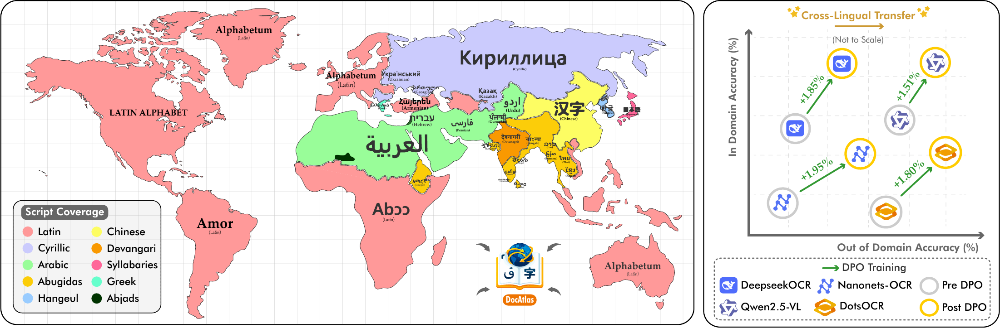
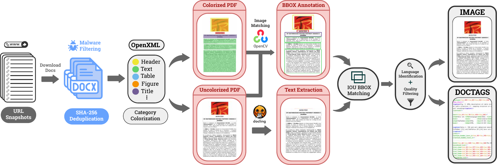
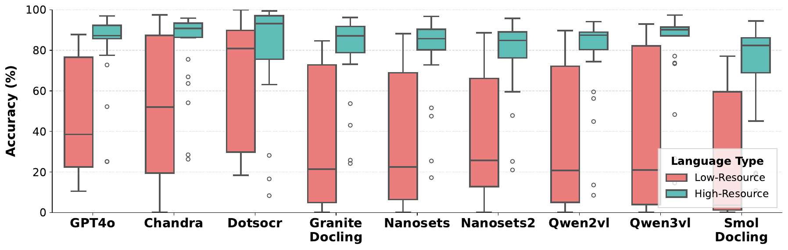
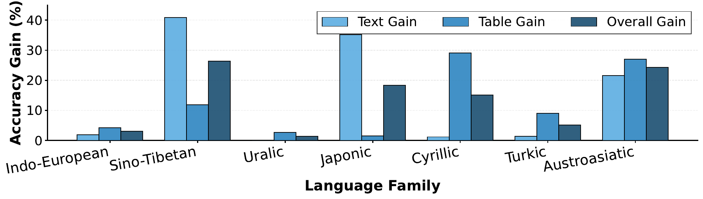

<h1 align="center">
  
  DocAtlas: Multilingual Document Understanding Across 80+ Languages
</h1>

<p align="center">
  Ahmed Heakl<sup>1</sup>, Youssef Mohamed<sup>1</sup>, Abdullah Sohail<sup>1</sup>, Rania Elbadry<sup>1</sup>,
  Ahmed Nassar<sup>2</sup>, Peter W. J. Staar<sup>2</sup>, Fahad Shahbaz Khan<sup>1</sup>, Imran Razzak<sup>1</sup>, Salman Khan<sup>1</sup>
  <br>
  <sup>1</sup>MBZUAI &nbsp;&nbsp; <sup>2</sup>IBM Research
</p>

<p align="center">
  <a href="https://arxiv.org/abs/2605.12623"></a>
  <a href="https://ahmedheakl.github.io/DocAtlas/"></a>
  <a href="https://huggingface.co/datasets/ahmedheakl/docatlas_instruct"></a>
  <a href="https://huggingface.co/datasets/ahmedheakl/DocAtlas-Bench"></a>
  <a href="https://github.com/EvolvingLMMs-Lab/lmms-eval/tree/main/lmms_eval/tasks/docatlas_bench"></a>
</p>

---

## 📣 Announcements

- **Oct 5, 2026**: 📊 Evaluation added to [lmms-eval](https://github.com/EvolvingLMMs-Lab/lmms-eval/tree/main/lmms_eval/tasks/docatlas_bench) as the `docatlas_bench` task.
- **Oct 2, 2026**: 🛠️ Evaluation code released in [`eval/`](eval).
- **Oct 2, 2026**: 🏅 Benchmark released: [DocAtlas-Bench](https://huggingface.co/datasets/ahmedheakl/DocAtlas-Bench).
- **May 19, 2026**: 🤗 Training data released: [docatlas_instruct](https://huggingface.co/datasets/ahmedheakl/docatlas_instruct).
- **May 12, 2026**: 📄 Paper released on [arXiv](https://arxiv.org/abs/2605.12623).

---

## 💡 DocAtlas

**DocAtlas** builds multilingual OCR datasets and benchmarks with model-free annotations: ground truth is extracted from the document sources by differential rendering and stored in a unified *DocTag* format. The result is a **360K-page training corpus** and a **5.8K-page benchmark** across **82 languages** and **9 tasks**.

<p align="center">
  <br>
  <em>(Left) Script coverage across 80+ languages and 10 writing systems. (Right) Cross-lingual transfer after DPO training, with gains in both in-domain and out-of-domain accuracy.</em>
</p>

---

## 🔥 Highlights

- **Model-free annotation:** differential rendering of 307K native Word documents across 82 languages gives layout, text and component labels from rendering differences alone.
- **Right-to-left coverage:** a LaTeX-based synthetic pipeline adds 52K precisely annotated pages in Arabic, Hebrew, Urdu and Persian.
- **Multilingual benchmark:** 5.8K difficulty-stratified pages across 82 languages and 9 tasks, with 14 state-of-the-art models evaluated.
- **Stable adaptation with DPO:** using rendering-derived ground truth as the positive signal improves in-domain (+1.9%) and out-of-domain (+1.8%) accuracy, where supervised fine-tuning degrades out-of-domain performance by up to 21%.

---

## 🛠️ Data Pipelines

**Pipeline A** recovers structure from the OpenXML markup of native Word documents, renders a colorized and an uncolorized version, and subtracts them pixel-wise to get per-category bounding boxes. **Pipeline B** synthesizes right-to-left documents through 205 LuaTeX templates that log the position of every element.

<p align="center">
  <br>
  <em>Pipeline A: from Common Crawl Word documents to page images with DocTag annotations.</em>
</p>

---

## 📊 Results

### 🏅 Leaderboard

Text Edit ↓, Table TEDS ↑, Formula Edit ↓ and Read Order Edit ↓ on the multilingual benchmark. Overall ↑ is the average of text accuracy and table TEDS.

| Type | Method | Params | Text Edit ↓ | Table TEDS ↑ | Formula Edit ↓ | Read Order Edit ↓ | Overall ↑ |
|---|---|:---:|:---:|:---:|:---:|:---:|:---:|
| General VLMs | Gemini-2.0-Pro | - | 0.090 | 68.50 | 0.356 | 0.050 | 79.75 |
| | GPT4o | - | 0.117 | 62.26 | 0.425 | 0.065 | 75.30 |
| | Qwen3-VL | 3B | 0.081 | 51.86 | 0.420 | 0.089 | 71.87 |
| | Qwen2.5-VL | 2B | 0.174 | 50.59 | 0.453 | 0.117 | 66.59 |
| | InternVL3.5 | 2B | 0.095 | 70.80 | 0.543 | 0.060 | 77.20 |
| Expert VLMs | DotsOCR | 3B | 0.068 | 65.40 | 0.321 | 0.037 | 79.29 |
| | PaddleOCR-VL | 1B | 0.078 | 73.90 | 0.241 | 0.052 | 80.10 |
| | DeepseekOCR | 3B | 0.082 | 71.54 | 0.242 | 0.053 | 81.66 |
| | MonkeyOCR-pro | 1.2B | 0.095 | 72.80 | 0.295 | 0.065 | 78.25 |
| | Dolphin | 400M | 0.160 | 58.30 | 0.465 | 0.066 | 71.17 |
| | Nanonets-OCR-s | 4B | 0.088 | 71.90 | 0.518 | 0.059 | 81.53 |
| | Nanonets-OCR2 | 3B | 0.088 | 66.24 | 0.471 | 0.060 | 78.70 |
| | Chandra | 9B | 0.071 | 69.79 | 0.262 | 0.042 | 81.33 |
| | MinerU2.5 | 1.2B | 0.267 | 72.79 | 0.273 | 0.096 | 73.07 |
| | **DocAtlas-Deepseek (Ours)** | 3B | 0.055 | 72.24 | 0.237 | 0.049 | 83.37 |

### 🌍 High- vs. Low-Resource Languages

High-resource languages stay at 80-95% accuracy, while low-resource scripts range from 20% to 85%, with the median often below 40%.

<p align="center">
  
</p>

### 🔁 DPO Gains Across Language Families

Sino-Tibetan, Japonic and Austroasiatic languages gain the most from DPO training; Indo-European and Uralic languages gain less than 5%.

<p align="center">
  
</p>

---

## 🚀 Evaluation

**With lmms-eval** ([task](https://github.com/EvolvingLMMs-Lab/lmms-eval/tree/main/lmms_eval/tasks/docatlas_bench)):

```bash
python -m lmms_eval --model <model> --tasks docatlas_bench --batch_size 1
```

**With the scripts in [`eval/`](eval):**

```bash
cd eval
pip install -r requirements.txt

python prepare_benchmark.py --out data                      # benchmark: ground truth + page images
python run_inference.py --images data/images --out predictions/my_model \
    --model my_model --base-url http://localhost:8000/v1 --api-key EMPTY   # one <page id>.md per image
python run_eval.py --gt data/DocAtlas-Bench.json --pred predictions/my_model --out results
python summarize.py results/
```

[`eval/README.md`](eval/README.md) has the prediction format, the metrics, and the vLLM launch commands and inference clients of the open models.

---

## 📜 Citation

```bibtex
@article{heakl2026docatlas,
  title={DocAtlas: Multilingual Document Understanding Across 80+ Languages},
  author={Heakl, Ahmed and Mohamed, Youssef and Sohail, Abdullah and Elbadry, Rania and Nassar, Ahmed and Staar, Peter WJ and Khan, Fahad Shahbaz and Razzak, Imran and Khan, Salman},
  journal={arXiv preprint arXiv:2605.12623},
  year={2026}
}
```

---

## 🙏 Acknowledgement

The evaluation code in [`eval/omnidocbench`](eval/omnidocbench) is adapted from [OmniDocBench](https://github.com/opendatalab/OmniDocBench) (Apache-2.0), and the evaluation is supported in [lmms-eval](https://github.com/EvolvingLMMs-Lab/lmms-eval). The code in this repository is released under the [MIT License](LICENSE) and the datasets under CC-BY 4.0.
